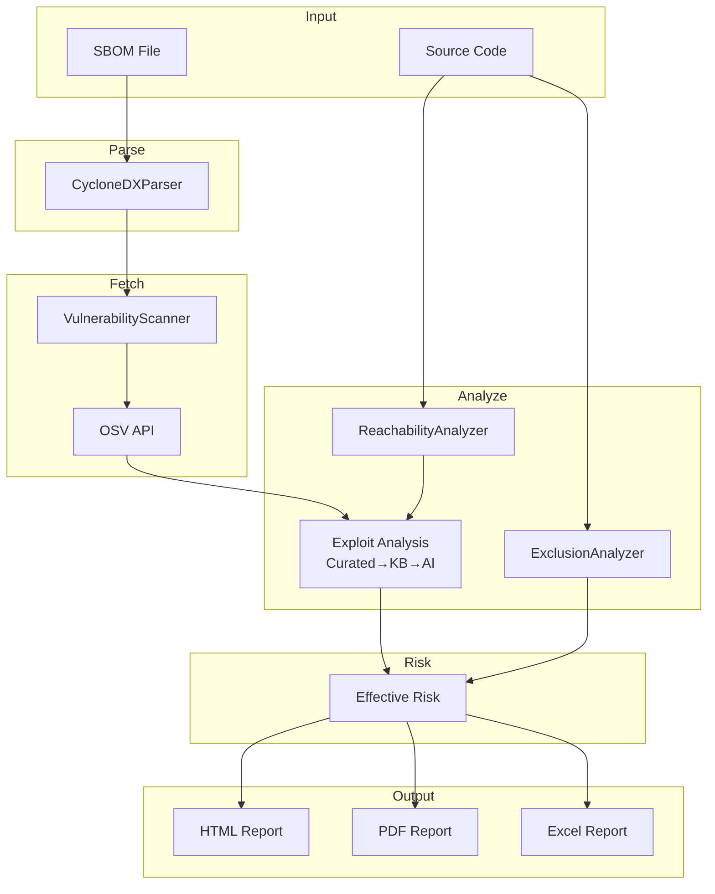

# Smart SCA Scanner – Architecture

## 1. System Overview

```
┌─────────────────────────────────────────────────────────────────────────────┐
│                         SMART SCA SCANNER                                    │
│              Software Composition Analysis (SCA) Pipeline                     │
│                                                                              │
│  SBOM → CVEs → Reachability + Exclusions + Exploit Analysis → Effective Risk │
└─────────────────────────────────────────────────────────────────────────────┘
```

---

## 2. High-Level Pipeline

```
┌──────────────┐    ┌──────────────┐    ┌──────────────┐    ┌──────────────┐    ┌──────────────┐
│   INPUT      │───>│   FETCH      │───>│   ANALYZE    │───>│   RISK       │───>│   OUTPUT     │
│   SBOM       │    │   CVEs       │    │   Context    │    │   Prioritize  │    │   Reports    │
└──────────────┘    └──────────────┘    └──────────────┘    └──────────────┘    └──────────────┘
     │                     │                    │                   │                   │
 CycloneDX            OSV API              Reachability         Effective Risk        HTML
 JSON/XML             (no key)             Exclusions          (see decision          PDF
                                           Exploit Analysis    table)                 Excel
```

---

## 3. Detailed Pipeline Flow

```
1. PARSE SBOM (CycloneDXParser)
   ├── CycloneDX JSON/XML (v1.4–1.6)
   ├── Extract: name, version, purl, group_id, ecosystem
   └── Ecosystems: Maven, npm, PyPI, NuGet, Go, Cargo, RubyGems, etc.

2. FETCH VULNERABILITIES (VulnerabilityScanner)
   ├── Query OSV API per component
   ├── CVE IDs, severity, CVSS, description, aliases
   └── No API key required

3. ANALYZE CONTEXT (parallel where applicable)
   │
   ├── ReachabilityAnalyzer (--source)
   │   ├── Index imports (Java, Python, JS/TS, Go)
   │   ├── Match component → imports
   │   ├── get_code_snippets() / get_code_snippets_with_locations()
   │   └── Output: REACHABLE / NOT REACHABLE, import_locations
   │
   ├── ExclusionAnalyzer (--source)
   │   ├── Parse Maven pom.xml
   │   ├── <exclusions>, scope (provided/test/system)
   │   └── Output: EXCLUDED / INCLUDED
   │
   └── Exploit Analysis (order: Curated → KB → AI)
       ├── Curated conditions (cve_conditions_knowledge_base.json)
       ├── KB cache (cve_knowledge_base.json) when --ai
       ├── AI: Ollama / Gemini / OpenAI / Claude
       ├── Heuristic fallback (keyword patterns)
       ├── Verify conditions in code → conditions_met, conditions_not_met
       ├── Resolve file:line for conditions_met (conditions_met_locations)
       └── Exploitability: All met→CRITICAL, Some→HIGH, None→LOW

4. CALCULATE EFFECTIVE RISK (Vulnerability.effective_risk)
   ├── Input: Base Severity, Reachable, Excluded, Exploitability
   ├── Rules: effective_risk_calculation.md
   └── Output: CRITICAL | HIGH | MEDIUM | LOW | INFORMATIONAL

5. GENERATE REPORTS
   ├── HTML: Interactive, filterable, evidence panels, file:line for conditions met
   ├── PDF: Executive summary, risk distribution
   ├── Excel: Summary, Vulnerabilities (with locations), Components, Exclusions
   ├── JSON: Full data (metadata, summary, components with all vulnerability details)
   └── Naming: {sbom_name}_report_{YYYYMMDD}_{HHMMSS}_{heuristic|ollama|gemini|openai}.html
```

---

## 4. Component Architecture

```
                                    smart_sca_scanner.py
                                              │
                    ┌─────────────────────────┼─────────────────────────┐
                    │                         │                         │
                    ▼                         ▼                         ▼
           ┌───────────────┐         ┌─────────────────┐         ┌─────────────────┐
           │   PARSING     │         │   SCANNING       │         │   REPORTING     │
           └───────┬───────┘         └────────┬────────┘         └────────┬────────┘
                  │                          │                            │
    ┌─────────────┴─────────────┐           │              ┌─────────────┴─────────────┐
    │ CycloneDXParser            │           │              │ EnhancedHTMLReportGenerator│
    │ - parse() JSON/XML         │           │              │ ExcelReportGenerator      │
    │ - extract components       │           │              │ PDFReportGenerator        │
    └───────────────────────────┘           │              └───────────────────────────┘
                                            │
                    ┌───────────────────────┼───────────────────────┐
                    │                       │                       │
                    ▼                       ▼                       ▼
           ┌───────────────┐       ┌─────────────────┐       ┌─────────────────┐
           │ Vulnerability │       │ Reachability    │       │ Exclusion       │
           │ Scanner       │       │ Analyzer        │       │ Analyzer        │
           │ - OSV API     │       │ - import index  │       │ - pom.xml       │
           │ - rate limit  │       │ - code snippets │       │ - exclusions    │
           └───────┬───────┘       │ - file:line     │       └─────────────────┘
                   │               └─────────────────┘
                   │
                   ▼
           ┌───────────────────────────────────────────────────────────────────┐
           │                    EXPLOIT ANALYSIS                                 │
           ├───────────────────────────────────────────────────────────────────┤
           │  Curated → KnowledgeBase → AI (Ollama/Gemini/OpenAI/Claude)       │
           │  HeuristicAnalyzer (default) | ExploitDBIntelligence (optional)    │
           │  _check_conditions_in_code() → conditions_met_locations (file:line)│
           └───────────────────────────────────────────────────────────────────┘
```

---

## 5. Data Model

```
Component
├── name, version, purl, group_id, ecosystem
└── vulnerabilities: list[Vulnerability]

Vulnerability
├── cve_id, severity, cvss_score, description, aliases
├── reachability: ReachabilityAnalysis
├── exclusion_info: ExclusionInfo
├── exploit_analysis: ExploitAnalysis
└── effective_risk (computed)

ReachabilityAnalysis
├── is_reachable
├── import_locations: ["path/to/file.java:42", ...]
└── usage_patterns

ExclusionInfo
├── is_excluded
├── excluded_in_files, excluded_by
└── exclusion_scope

ExploitAnalysis
├── conditions, conditions_met, conditions_not_met
├── conditions_met_locations: {condition: ["file:line", ...]}
├── exploitability: CRITICAL|HIGH|MEDIUM|LOW|UNKNOWN
└── reasoning
```

---

## 6. Exploit Analysis Flow

```
                    ┌─────────────────────────────────────┐
                    │         CVE to Analyze               │
                    └─────────────────┬───────────────────┘
                                      │
                    ┌─────────────────▼───────────────────┐
                    │ 1. Curated conditions (--kb-config)   │
                    │    cve_conditions_knowledge_base.json │
                    └─────────────────┬───────────────────┘
                                      │ found?
                    ┌─────────────────┼─────────────────┐
                    │ Yes             │                 │ No
                    ▼                 │                 ▼
            ┌───────────────┐         │         ┌───────────────────┐
            │ Use curated   │         │         │ 2. KB cache       │
            │ Verify in code│         │         │ cve_knowledge_    │
            └───────┬───────┘         │         │ base.json (--ai)   │
                    │                 │         └─────────┬─────────┘
                    │                 │                   │ found?
                    │                 │         ┌────────┼────────┐
                    │                 │         │ Yes    │        │ No
                    │                 │         ▼        │        ▼
                    │                 │  ┌───────────┐   │  ┌─────────────────┐
                    │                 │  │ Use cached│   │  │ 3. AI or Heuristic│
                    │                 │  │ Verify    │   │  │ Ollama/Gemini/   │
                    │                 │  │ in code   │   │  │ OpenAI/Claude    │
                    │                 │  └─────┬─────┘   │  │ or Heuristic     │
                    │                 │        │         │  └────────┬────────┘
                    └────────────────┼────────┼─────────┘           │
                                     │        │                     │
                                     ▼        ▼                     ▼
                    ┌─────────────────────────────────────────────────────────┐
                    │ _check_conditions_in_code(conditions, code_context,       │
                    │   snippets_with_locations)                                │
                    │ → conditions_met, conditions_not_met,                    │
                    │   conditions_met_locations {cond: ["file:line", ...]}    │
                    └─────────────────────────────────────────────────────────┘
```

---

## 7. Effective Risk Decision Tree

```
                    ┌─────────────────────────────────────┐
                    │  Vulnerability                       │
                    │  (severity, reachable, excluded,     │
                    │   exploitability)                    │
                    └─────────────────┬───────────────────┘
                                      │
              ┌───────────────────────┼───────────────────────┐
              │                       │                       │
              ▼                       ▼                       ▼
    ┌─────────────────┐   ┌─────────────────┐   ┌─────────────────┐
    │ Not Reachable    │   │ Reachable       │   │ Included        │
    │ AND Excluded     │   │ AND Excluded    │   │ (any reach)     │
    └────────┬────────┘   └────────┬────────┘   └────────┬────────┘
             │                     │                     │
             ▼                     ▼                     ▼
    ┌─────────────────┐   ┌─────────────────┐   ┌─────────────────┐
    │ INFORMATIONAL   │   │ Exploitability   │   │ Severity ×      │
    │ (no exploit     │   │ checked, capped  │   │ Exploitability  │
    │  check)         │   │ at base severity │   │ (capped at sev) │
    └─────────────────┘   └─────────────────┘   └─────────────────┘
```

See **[effective_risk_calculation.md](effective_risk_calculation.md)** for the full decision table.

---

## 8. File Structure

```
SCA-automation/
├── smart_sca_scanner.py              # Single-file implementation
├── cve_knowledge_base.json            # CVE → conditions (auto-populated when --ai)
├── cve_conditions_knowledge_base.json # Curated conditions, keyword_aliases, package_mappings
├── effective_risk_calculation.md      # Risk decision table
├── ARCHITECTURE.md                    # This file
├── README.md
├── commands.txt
├── requirements.txt
├── sample_sbom_10_vulns.json
└── sample-java-project/               # Sample source for reachability
```

---

## 9. Class / Module Mapping

| Class / Module | Responsibility |
|----------------|----------------|
| `CycloneDXParser` | Parse SBOM JSON/XML, extract components |
| `VulnerabilityScanner` | Query OSV API, map CVEs to components |
| `ReachabilityAnalyzer` | Index imports, match components, extract code snippets + file:line |
| `ExclusionAnalyzer` | Parse pom.xml, detect exclusions |
| `KnowledgeBase` | Persist CVE conditions (JSON), merge AI/heuristic results |
| `AIProvider` (ABC) | Interface for exploit analysis |
| `HeuristicAnalyzer` | Pattern-based analysis (default) |
| `OpenAIProvider`, `OllamaProvider`, `GeminiProvider`, `ClaudeProvider` | AI-based condition extraction + verification |
| `ExploitDBIntelligence` | Optional exploit-db.com data |
| `EnhancedHTMLReportGenerator` | HTML report with evidence panels, file:line |
| `ExcelReportGenerator` | Multi-sheet Excel |
| `PDFReportGenerator` | PDF report |

---

## 10. External Dependencies

| Service | Purpose | API Key |
|---------|---------|---------|
| OSV (osv.dev) | Vulnerability data | No |
| Ollama | Local LLM (optional) | No |
| Google Gemini | AI analysis (optional) | Yes |
| OpenAI | AI analysis (optional) | Yes |
| Anthropic Claude | AI analysis (optional) | Yes |
| Exploit-DB | Exploit intelligence (optional) | No |

---

## 11. Mermaid Diagram


